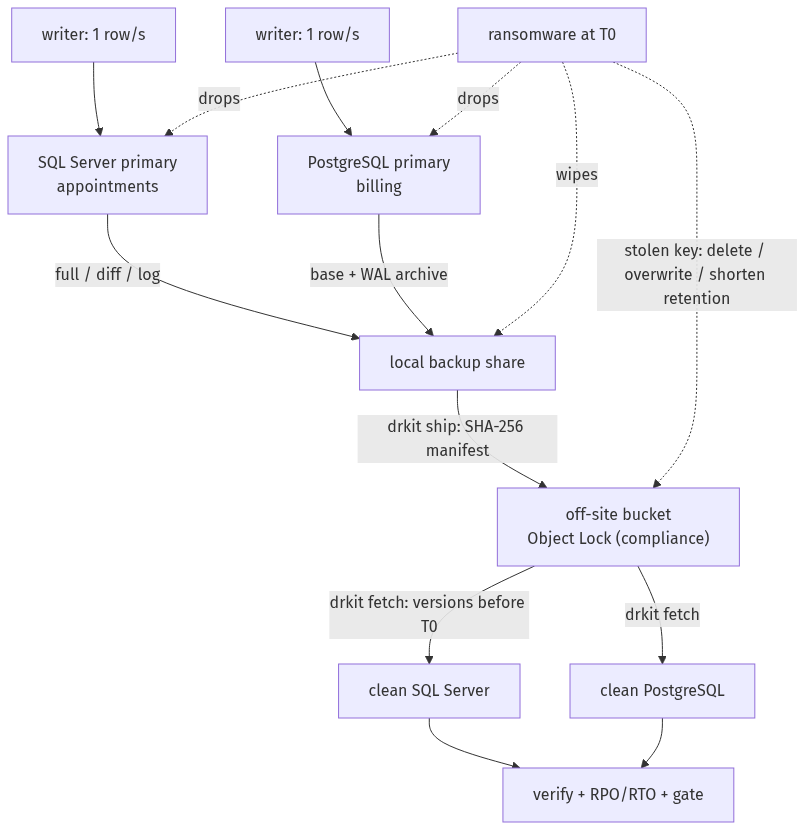

# Lab 10 — Backup and disaster recovery with a ransomware drill

Back up a SQL Server and a PostgreSQL database to a local tier and an immutable off-site tier, then prove recovery:
a scripted ransomware destroys both databases and the local backups and tries to delete the off-site copies with the
stolen backup key; the databases are restored from the immutable copy alone to clean hosts, verified, and the
achieved RPO and RTO are measured against written targets. A DR runbook and a ransomware tabletop complete it.

**Status: in progress.** Every result comes from GitHub Actions runs against containers with synthetic data.

## How the drill works



1. **Start** two primaries (SQL Server 2025, PostgreSQL 18) with a writer each that inserts one row per second
   (the ground truth for data loss), two clean restore containers and MinIO with an **Object Lock** bucket in
   compliance mode. The backup writer key may delete objects and versions: only the lock can stop someone holding it.
2. **Back up on a compressed schedule**: SQL Server full, then log backups every 15 policy minutes and a differential
   at 360; PostgreSQL a base backup and continuous WAL archiving. Files land on the local backup share.
3. **Ship**: `drkit ship` copies every finished file to the bucket with a retention date and records it in a manifest
   (object version + SHA-256), itself uploaded and locked.
4. **Attack at T0**: the ransomware stops the backup agent, drops both databases, wipes the local share and, with the
   stolen key, tries to delete every version, shorten retention, overwrite and delete. Every refusal is recorded;
   any destroyed version fails the drill.
5. **Recover** from the bucket alone: `drkit fetch` reads only object versions written before T0, selects the restore
   chain (full + newest differential + every later log; base + contiguous WAL), checks each SHA-256 and restores to
   the clean containers.
6. **Verify and measure**: consistency checks (`DBCC CHECKDB`, `pg_amcheck`), contiguous rows; achieved RPO from the
   newest restored row, achieved RTO from declaration to verification. The gate fails on a missed target, an
   unverified restore or a lost off-site version.

## Quick start (Linux, macOS or WSL with Docker)

```bash
python -m venv .venv && . .venv/bin/activate
pip install -r requirements.txt && pip install --no-deps -e .
eval "$(bash scripts/make-secrets.sh)"     # per-run passwords and the backup writer key
bash scripts/run-drill.sh
# then open out/report.html (results: out/results.json)
```

`docker compose -f lab/compose.yaml down -v` removes the containers.

## Policy

Values in [`policy/dr-policy.yaml`](policy/dr-policy.yaml).

| System | Engine | RPO target | RTO target | Backups |
|---|---|---|---|---|
| `appointments` | SQL Server 2025 | ≤ 15 min | ≤ 30 min | full daily, differential every 6 h, log every 15 min |
| `billing` | PostgreSQL 18 | ≤ 5 min | ≤ 60 min | base weekly, WAL archived continuously (`archive_timeout` 60 s) |

Retention: 14 days local and off-site (the CI bucket locks for 1 day; the runner is discarded after the job).

**Compressed time.** The drill plays the schedule at one policy minute per real second (policy minutes 0–400, attack
at 400). RPO depends on the backup interval, which is compressed: it is measured in real seconds and converted to
policy minutes for the comparison (both are reported). RTO depends on the restore work, which is not compressed: it
is real minutes against the target.

## Runbook and tabletop

- [`docs/runbook.md`](docs/runbook.md) ([ES](docs/runbook.es.md)) — roles, decision points (trustworthy data, clean
  hosts, the last *safe* restore point, return to service) and per-engine procedures with the commands the drill runs.
- [`docs/tabletop-ransomware.md`](docs/tabletop-ransomware.md) ([ES](docs/tabletop-ransomware.es.md)) — a written
  exercise with timed injects; the drill is its technical half.

## CI and tests

| Job | What it proves |
|---|---|
| `lint` | ruff, mypy (strict), shellcheck |
| `unit` | schedule, manifest, attack and survival on a fake versioned store with Object Lock, shipping, restore chain (gaps, stale differential, post-T0 files), fetch (post-T0 versions ignored, checksum mismatch), RPO/RTO, report escaping, gate; coverage gate 90 % |
| `drill` | the whole cycle on both engines; artifacts: report (HTML/Markdown/JSON), attack log, manifests and restore chains, timings |
| `secrets` | gitleaks over the full history |

The drill also runs weekly and on demand.

## Limits

- Containers and synthetic data; small databases, so the absolute RTO minutes do not transfer to production.
- Compressed time (above).
- MinIO (Chainguard build) stands in for cloud immutable storage (S3 Object Lock, Azure immutable blobs).
- The tabletop is written, not run with people.
- Out of scope: real cloud storage, backup encryption key management, VM and file-server backups, high availability.

## License

MIT — see [LICENSE](LICENSE).
